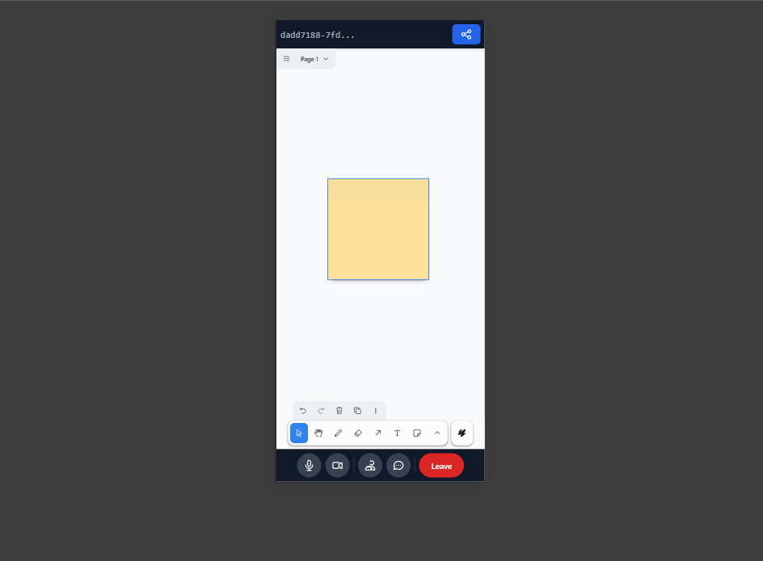

# AWC — Live Collaboration Platform


AWC is a production-ready, real-time collaboration platform that combines video conferencing, text chat, and a collaborative whiteboard (tldraw) — all built with WebRTC, PeerJS, Socket.IO, and React + Vite. The app is designed to be responsive, performant, and developer-friendly.

## Gallery

A few screenshots showing the UI, responsiveness and core features.

<p align="center">
  
  
</p>

<p align="center">
  
  
  
</p>

_These images are sourced from the repository's `images/` folder; update them if you want different screenshots or higher-resolution assets._

> Note: Replace the screenshots above with actual conference/whiteboard screenshots for your marketing or README improvements. The assets referenced exist under `Frontend/public/assets`.


## Highlights

- Real-time video/audio using WebRTC + PeerJS
- Text chat with persistent storage
- Collaborative whiteboard powered by tldraw with history sync for late joiners
- Room presence (participants list) and real-time updates
- Join without granting camera/microphone (dummy stream fallback) — enable devices later
- Scalable backend using Socket.IO and modular socket handlers
- Jobs & workers (recording uploader, snapshot saver) and cron cleanup for production readiness
- Responsive UI built with React, Tailwind CSS and Vite


## Table of contents

- [Architecture](#architecture)
- [Getting started](#getting-started)
  - [Prerequisites](#prerequisites)
  - [Environment variables](#environment-variables)
  - [Run locally](#run-locally)
- [How the real-time pieces fit together](#how-the-real-time-pieces-fit-together)
  - [Socket events (important)](#socket-events-important)
  - [Whiteboard history / sync flow](#whiteboard-history--sync-flow)
- [Development notes & troubleshooting](#development-notes--troubleshooting)
- [Project structure (overview)](#project-structure-overview)
- [Contributing](#contributing)
- [License](#license)


## Architecture

AWC ships with a full-stack layout:

- Backend (Node + Express)
  - Socket.IO for real-time events
  - PeerJS Express server for WebRTC signaling
  - MongoDB for persistence (users, chat messages, rooms)
  - Cron jobs and background workers for recordings and snapshots

- Frontend (React + Vite)
  - tldraw whiteboard for collaborative drawing
  - PeerJS client + adapter for media streams and peer connections
  - Redux toolkit for app state, plus middleware to bridge socket events


## Getting started

### Prerequisites

- Node.js (LTS; tested on v18+)
- npm
- MongoDB (local or remote)


### Environment variables

Create a `.env` file in the `Backend/` folder. Required values (example):

```
PORT=8000
MONGO_URI=mongodb://localhost:27017/awc_db
JWT_SECRET=supersecretkey
CORS_ORIGIN=http://localhost:5173
```

If you run the frontend on a different port (Vite default 5173), set `CORS_ORIGIN` accordingly.

If you need to override the socket URL for the frontend, create a `.env` in `Frontend/` with:

```
VITE_SOCKET_URL=http://localhost:8000
```


### Run locally (two terminals)

Start the backend server:

```powershell
cd Backend
npm install
npm run dev
```

Start the frontend (in a separate terminal):

```powershell
cd Frontend
npm install
npm run dev
```

Open your browser at `http://localhost:5173` (or the Vite dev url shown in the terminal).


## How the real-time pieces fit together

- Socket.IO handles room-level signaling and events (chat, whiteboard updates, presence).
- PeerJS (server and clients) handles WebRTC peer-to-peer connections and media negotiation. The PeerJS server is mounted at `/peerjs` on the backend.
- Whiteboard uses a hybrid approach:
  - Incremental tldraw changes are broadcast to other clients as `tldraw:update`.
  - When a user joins a room, they emit `whiteboard:join`. The server asks existing clients to provide a full document (`whiteboard:request_full`). The first client to respond sends `whiteboard:full` to the server which forwards it as `whiteboard:history` to the joiner. The joiner then `editor.store.load(document)`.


### Socket events (important)

- Room presence
  - `room:join` — client -> server (join room)
  - `room:leave` — client -> server (leave room)
  - `room:participants` — server -> clients (updated participant list)
  - `user:joined` / `user:left` — server -> others (inform when a user comes/goes)

- Chat
  - `chat:send_message` — client -> server (send a message)
  - `chat:message` — server -> others (broadcast message to other clients in room)

- Whiteboard / tldraw
  - `tldraw:update` — client -> server -> other clients (incremental changes)
  - `whiteboard:join` — client -> server (ask for full document)
  - `whiteboard:request_full` — server -> existing clients (request a full doc)
  - `whiteboard:full` — client -> server (sends full doc to server)
  - `whiteboard:history` — server -> requester (forwarded full doc)


## Whiteboard sync flow (late joiners)

1. New client emits `whiteboard:join` (roomId).
2. Server broadcasts `whiteboard:request_full` to other clients in room with `requesterId`.
3. Any existing client that has a full document responds with `whiteboard:full` including the serialized document and `requesterId`.
4. Server forwards the payload as `whiteboard:history` to the requester.
5. Requester calls `editor.store.load(document)` to load the shared state.

This ensures a consistent starting state for late joiners while incremental updates continue flowing.


## Join without camera/mic

To improve UX and privacy, the frontend supports a fallback dummy MediaStream when `getUserMedia` is denied. This lets users join the meeting without granting camera/mic access and still participate in chat and the whiteboard. When they later click the camera or mic toggle, the app attempts to replace the dummy track with a real device track using `replaceTrackWithDevice('video'|'audio')` and updates the peer senders accordingly.


## Development notes & troubleshooting

- If participants or chat messages don't appear across tabs:
  - Ensure both clients connect to the same socket URL (VITE_SOCKET_URL or default `http://localhost:8000`).
  - Check the backend logs for `room:join`, `room:participants`, and chat forwarding messages (the server logs these events by default in dev mode).
  - Make sure the browser consoles show no CORS errors or websocket connection errors.

- Keys and ports
  - Backend default port: `8000` (configurable via `PORT`).
  - Frontend default dev port: Vite usually runs on `5173`.

- Rebuilding production bundle

```powershell
cd Frontend
npm run build
# serve with npm run preview or any static server that points to Frontend/dist
```


## Project structure (short)

- Backend/
  - src/
    - sockets/ — socket handlers for rooms, chat, whiteboard
    - services/ — persistence and utility services
    - jobs/, cron/ — background tasks
    - app.js, server.js — express / server bootstrap

- Frontend/
  - src/
    - features/ — chat, video, whiteboard modules
    - context/SocketProvider.jsx — shared socket instance
    - features/video/hooks/usePeerJS.js — PeerJS integration
    - features/whiteboard/components/TldrawCanvas.jsx — tldraw + socket integration


## Responsiveness & Accessibility

- UI built with Tailwind CSS and designed mobile-first.
- Main layout adapts to narrow viewports (side panels collapse into drawers on small screens).
- Controls provide keyboard-accessible focus states; add more a11y attributes and testing as needed.


## Contributing

Contributions are welcome. Suggested workflow:

1. Fork the repo
2. Create a branch for your feature/fix: `git checkout -b feat/your-feature`
3. Run the app locally and add tests if applicable
4. Open a PR with a clear description and screenshots


## License

This project is open-source. Add your chosen license file (e.g., MIT) in the root.


---

If you'd like, I can:
- Add actual screenshot images to `Frontend/public/assets` and reference them in this README.
- Generate a small architecture SVG and include it in the README.
- Add a quick TL;DR section or one-page marketing description for README front page.

Which extra would you like next?